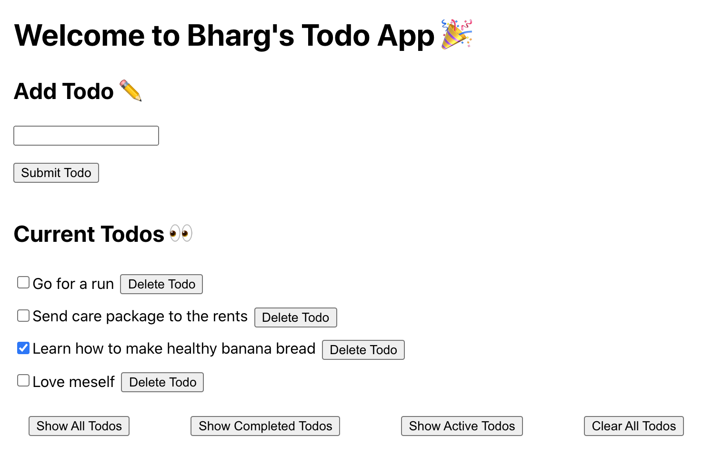

# ToDo App with React, Express & Postgres

## Running it

```bash
nvm use 17

cd server
docker-compose up --build

# in another shell
cd client
npm install & npm start
```

You should see something like below



## Accessing DB locally

```
psql -h localhost -p 5432 -U bharg -d dev
```

## Reflection

### What I'd to add
- Tests! I would've really liked to add some unit tests and e2e cypress tests
- CSS, emojis help but let's be honest its very bare bones
- Add functionality for updating done todos in the DB
- Sort parts of the frontend into components, extract from App and refactor
